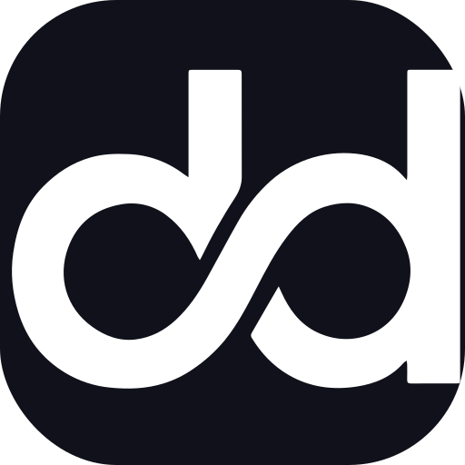
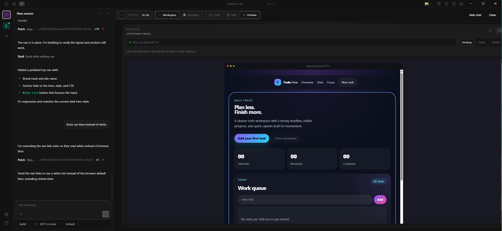
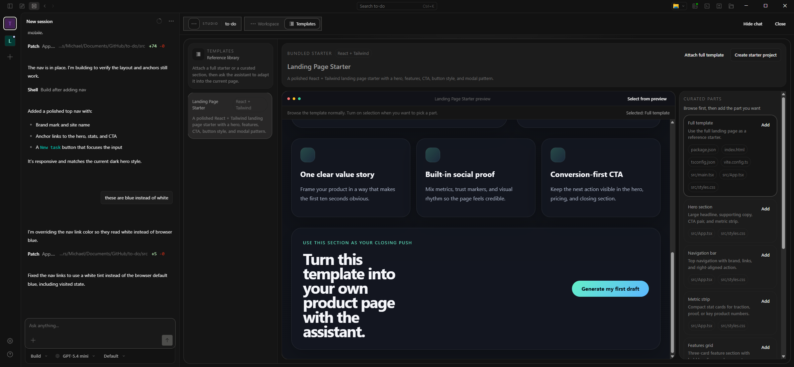

<p align="center">
  
</p>

<h1 align="center">Paddie Studio</h1>

<p align="center">
  A unified visual environment for designing, previewing, and shaping production code with AI.
</p>

<p align="center">
  Build visually.
  |
  Direct the assistant.
  |
  Export the codebase anytime.
  |
  <a href="#development">Development</a>
  |
  <a href="#desktop-builds">Desktop builds</a>
</p>

---

Paddie Studio is built to collapse the distance between chat, canvas, and code.
Instead of bouncing between a browser preview, an editor, and an assistant thread, you stay in one workspace where you can inspect a live app, select real UI elements, attach templates, and ask the assistant to implement changes directly against the project.

Today, the core experience centers on:

- a Studio shell that keeps chat and product work side by side
- a live browser canvas that follows the running localhost app
- direct code editing with a real filesystem and Monaco tabs
- template-driven building for pages and reusable sections
- element picking from preview into chat context

Paddie Studio is being shaped toward a broader visual development workflow that combines interface building, reusable templates and components, richer project memory, and more automation over time.

## Screenshots

<table>
  <tr>
    <td width="50%">
      
      <p><strong>Studio + live preview</strong><br>Chat, Studio controls, and the live browser canvas all stay visible in one desktop workflow.</p>
    </td>
    <td width="50%">
      
      <p><strong>Templates surface</strong><br>Browse bundled starters, inspect curated parts, and attach full templates or selected sections into chat.</p>
    </td>
  </tr>
</table>

## Introducing Paddie Studio

### Design. Preview. Iterate.

Paddie Studio combines a visual product workspace with an AI co-developer so you can move from idea to implementation without switching tools every few minutes.

The Studio surface keeps these views close together:

- `Code`
- `Split`
- `Preview`
- `Templates`

That means you can inspect the product, edit the source, and direct the assistant from one place.

### Visual interface workflow

The current Studio workflow is centered on a live, product-facing canvas:

- preview follows the active localhost app automatically
- desktop, tablet, and mobile viewport switching
- real desktop viewport presets including `1920x1080`, `1600x900`, and `1440x900`
- direct element selection from the preview into chat
- responsive Studio resizing beside chat

If you want to work manually, the same shell also gives you:

- filesystem explorer for the current project
- Monaco editor tabs
- direct typing and editing in code
- autosave by default

### Your AI co-developer lives inside the editor

Instead of describing changes against a vague screenshot, you can work with real project context:

- ask the assistant to run the app
- let preview follow the running URL
- pick real elements from the page
- attach files, template parts, and selected targets to the prompt
- ask the assistant to apply changes with that context already attached

This is the core Paddie Studio loop today.

### Start with a template

Paddie Studio includes a bundled template system for reference-driven building:

- browse a starter visually
- attach a full template to chat
- attach curated parts like hero, CTA, button, modal, navbar, and metrics
- select parts directly from the template preview
- create a starter project from the bundled template

The current seeded template is a React + Tailwind landing-page starter, and the longer-term direction is to expand this into a richer component and template ecosystem.

## Product Direction

Paddie Studio is being shaped toward a broader visual development system built around three bigger ideas:

### 1. Production-ready templates and components

The template system is meant to grow beyond a single starter into a reusable library of:

- full-page starters
- curated sections
- reusable components
- community and marketplace-style building blocks over time

### 2. Visual automation and workflow building

The longer-term goal is not just UI generation, but a workspace where interface building and backend workflow orchestration can live closer together, so design, logic, and automation are part of one system instead of separate tools.

### 3. Smarter project memory

Paddie Studio is also being steered toward deeper memory and context handling, so the assistant becomes better at:

- remembering project structure
- reusing prior design and implementation decisions
- applying richer context across multiple iterations

## Workflow

### Build with AI

1. Open a project in Paddie Studio.
2. Ask the assistant to run the app.
3. Let the preview follow the running localhost URL automatically.
4. Pick elements in the preview or attach a template.
5. Ask the assistant to modify the selected target.
6. Edit code directly when you want manual control.

### Start from a template

1. Open `Templates` inside Studio.
2. Browse the bundled starter.
3. Attach the full template or a selected part to chat.
4. Ask the assistant to adapt it into the current page.

Or:

1. Use `Create starter project`.
2. Choose a destination folder.
3. Open the new project in Studio and continue from there.

## Open Source and Upstream

Paddie Studio is an official public fork of OpenCode:

- fork: [michaelegbo/opencode](https://github.com/michaelegbo/opencode)
- upstream: [anomalyco/opencode](https://github.com/anomalyco/opencode)

That relationship matters for maintenance, but it is not the product story.
The fork stays structurally close to upstream so new OpenCode changes can still be pulled in, while Paddie Studio focuses the product layer around:

- desktop-first usage
- visual UI building
- richer preview workflows
- templates and reusable product patterns
- branded packaging and app identity

## Development

### Prerequisites

- [Bun](https://bun.sh/)
- Rust toolchain for the Tauri desktop app
- Windows is the current tested desktop packaging path

### Install

```bash
bun install
```

### Run the web app

```bash
bun run dev:web
```

### Run the desktop app

```bash
bun run dev:desktop
```

### Typecheck

Run typechecks from package directories, not from the repo root:

```bash
cd packages/app
bun run typecheck

cd ../desktop
bun run typecheck
```

## Desktop Builds

Build the desktop installer from the desktop package:

```bash
cd packages/desktop
bun run tauri build
```

Windows artifacts are written to:

- `packages/desktop/src-tauri/target/release/PaddieStudio.exe`
- `packages/desktop/src-tauri/target/release/bundle/nsis/`

## Repository Layout

- `packages/app` - main UI, Studio shell, templates, preview, and editor integration
- `packages/desktop` - Tauri desktop wrapper, packaging, app identity, native filesystem and process hooks
- `packages/opencode` - agent runtime and server core inherited from OpenCode
- `packages/ui` - shared UI primitives, icons, logo, and theme surfaces

## Contribution Flow

This repo uses a protected-branch workflow:

- `dev` is the default integration branch
- `main` is protected
- changes should land through pull requests

If you are contributing to the fork:

1. branch from `dev`
2. open a PR back into `dev`
3. merge into `main` only when the work is approved

## Upstream Sync

This project is a maintained fork, not a plugin layer. That means product features live in real app files, but the repo still tracks upstream OpenCode.

A typical sync flow is:

```bash
git remote add upstream https://github.com/anomalyco/opencode.git
git fetch upstream
git merge upstream/dev
```

Because Paddie Studio changes core UI surfaces, some upstream syncs may need manual conflict resolution.

## Current Product Areas

Active product work in this fork includes:

- Studio layout and responsive resizing
- preview viewport controls
- preview-to-chat element picking
- template browsing and starter creation
- desktop branding and icon system
- visual frontend building workflow

## License

MIT.

See upstream notices and commit history for provenance where this fork builds on OpenCode.
