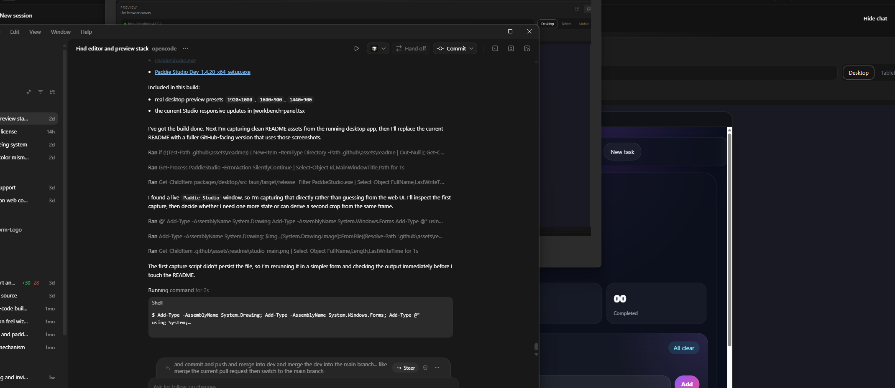
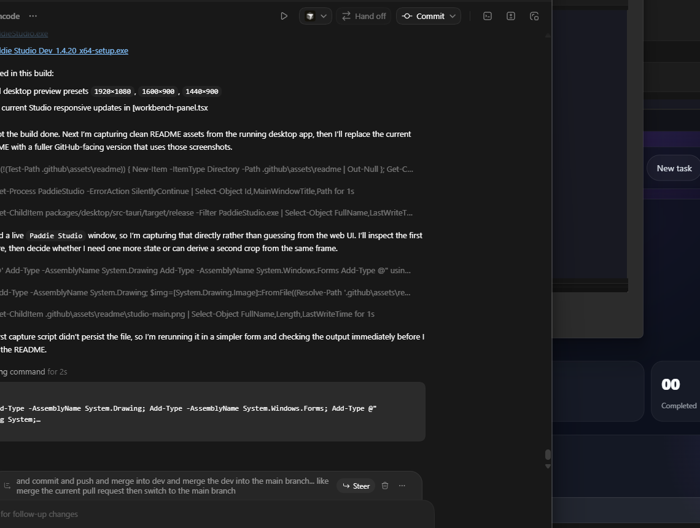
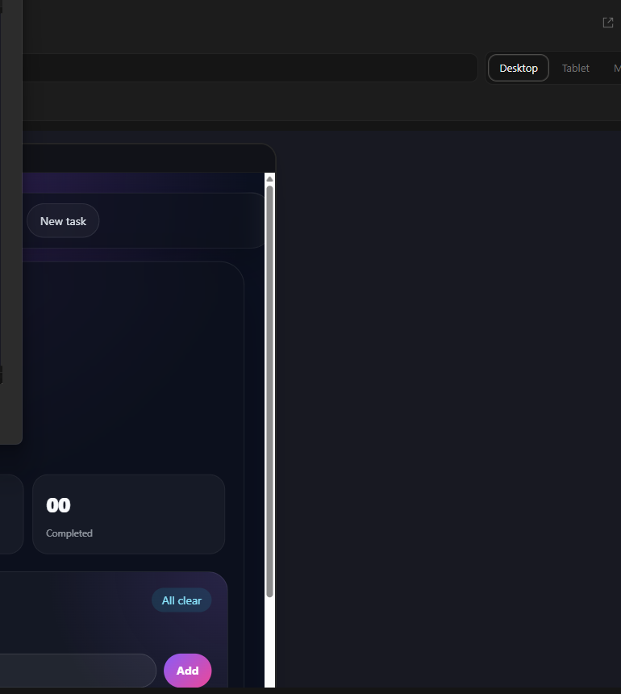

<p align="center">
  
</p>

<h1 align="center">Paddie Studio</h1>

<p align="center">
  Desktop-first AI coding workspace built as an official fork of
  <a href="https://github.com/anomalyco/opencode">OpenCode</a>.
</p>

<p align="center">
  <a href="https://github.com/michaelegbo/opencode">Official fork</a>
  |
  <a href="https://github.com/anomalyco/opencode">Upstream</a>
  |
  <a href="#development">Development</a>
  |
  <a href="#desktop-builds">Desktop builds</a>
</p>

---

Paddie Studio keeps the OpenCode runtime and agent model, then layers on a more visual product workflow:

- chat and Studio side by side
- filesystem explorer + Monaco editor in the same shell
- AI-run localhost preview that follows the active app automatically
- desktop, tablet, and mobile viewport switching
- element picking from preview directly into chat context
- bundled templates that can be attached to chat or used to create starters

It is designed for building, reviewing, and iterating on frontend products without bouncing between separate apps.

## Screenshots



<table>
  <tr>
    <td width="50%">
      
      <p><strong>Studio workspace</strong><br>Chat, files, code, and preview can live in a single side-by-side flow.</p>
    </td>
    <td width="50%">
      
      <p><strong>Live browser canvas</strong><br>Preview follows the running localhost app and supports desktop, tablet, and mobile views.</p>
    </td>
  </tr>
</table>

## What Paddie Studio Adds

### 1. Studio beside chat

OpenCode is extended with a persistent Studio shell that sits beside the conversation instead of replacing it. You can keep the AI conversation open while working in:

- `Code`
- `Split`
- `Preview`
- `Templates`

The chat can be shown or hidden, and the Studio surface can be resized without leaving the current session.

### 2. Real editing workflow

Paddie Studio turns the workspace into a proper local editor:

- filesystem explorer for the current project
- Monaco editor tabs
- direct typing and editing inside the code surface
- autosave by default
- smooth transitions between code and preview layouts

### 3. AI-driven preview

The preview is designed to feel like a product canvas instead of a detached browser:

- follows localhost URLs from chat or the main terminal
- supports desktop, tablet, and mobile preview modes
- desktop presets include `1920x1080`, `1600x900`, and `1440x900`
- can open the running app externally when needed

### 4. Element picker

You can select elements directly from the preview and send them into the composer as structured context. This lets you say things like:

- "Tighten the spacing on this section"
- "Restyle this CTA"
- "Move this block above the fold"

The picker stays active so you can add multiple elements before prompting the model.

### 5. Templates

Paddie Studio includes a bundled template system for reference-driven building:

- browse a starter visually
- attach a full template to chat
- attach curated parts like hero, CTA, button, or modal
- select template parts from preview
- create a starter project from the bundled template

The current seeded template is a React + Tailwind landing-page starter.

## Workflow

### Build with AI

1. Open a project in Paddie Studio.
2. Ask the assistant to run the app.
3. Let the preview follow the running localhost URL automatically.
4. Pick elements in the preview or attach a template.
5. Ask the assistant to modify the selected target.
6. Edit code directly when you want manual control.

### Start from a template

1. Open `Templates` inside Studio.
2. Browse the bundled starter.
3. Attach the full template or a selected part to chat.
4. Ask the assistant to adapt it into the current page.

Or:

1. Use `Create starter project`.
2. Choose a destination folder.
3. Open the new project in Studio and continue from there.

## Why This Repo Exists

Paddie Studio is an official public fork of OpenCode at:

- [michaelegbo/opencode](https://github.com/michaelegbo/opencode)

Upstream remains:

- [anomalyco/opencode](https://github.com/anomalyco/opencode)

This fork stays structurally close to upstream so new upstream changes can still be pulled in, while the product layer evolves around:

- desktop-first usage
- visual UI building
- richer preview workflows
- branded packaging and app identity

## Development

### Prerequisites

- [Bun](https://bun.sh/)
- Rust toolchain for the Tauri desktop app
- Windows is the current tested desktop packaging path

### Install

```bash
bun install
```

### Run the web app

```bash
bun run dev:web
```

### Run the desktop app

```bash
bun run dev:desktop
```

### Typecheck

Run typechecks from package directories, not from the repo root:

```bash
cd packages/app
bun run typecheck

cd ../desktop
bun run typecheck
```

## Desktop Builds

Build the desktop installer from the desktop package:

```bash
cd packages/desktop
bun run tauri build
```

Windows artifacts are written to:

- `packages/desktop/src-tauri/target/release/PaddieStudio.exe`
- `packages/desktop/src-tauri/target/release/bundle/nsis/`

## Repository Layout

- `packages/app` - main UI, Studio shell, templates, preview, and editor integration
- `packages/desktop` - Tauri desktop wrapper, packaging, app identity, native filesystem and process hooks
- `packages/opencode` - agent runtime and server core inherited from OpenCode
- `packages/ui` - shared UI primitives, icons, logo, and theme surfaces

## Contribution Flow

This repo uses a protected-branch workflow:

- `dev` is the default integration branch
- `main` is protected
- changes should land through pull requests

If you are contributing to the fork:

1. branch from `dev`
2. open a PR back into `dev`
3. merge into `main` only when the work is approved

## Upstream Sync

This project is a maintained fork, not a plugin layer. That means product features live in real app files, but the repo still tracks upstream OpenCode.

A typical sync flow is:

```bash
git remote add upstream https://github.com/anomalyco/opencode.git
git fetch upstream
git merge upstream/dev
```

Because Paddie Studio changes core UI surfaces, some upstream syncs may need manual conflict resolution.

## Current Product Areas

Active product work in this fork includes:

- Studio layout and responsive resizing
- preview viewport controls
- preview-to-chat element picking
- template browsing and starter creation
- desktop branding and icon system
- visual frontend building workflow

## License

MIT.

See upstream notices and commit history for provenance where this fork builds on OpenCode.
